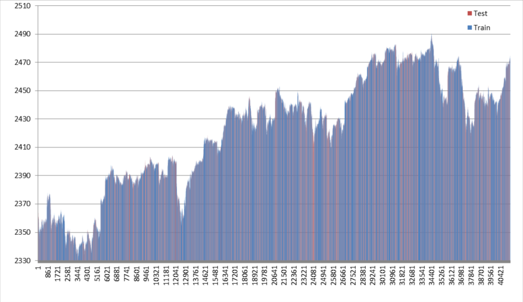
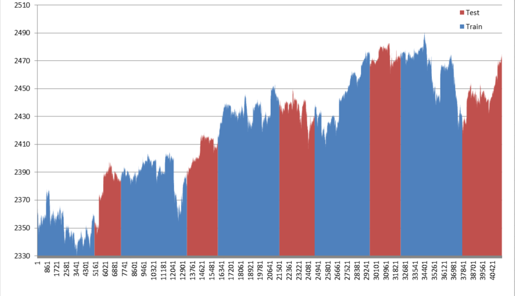
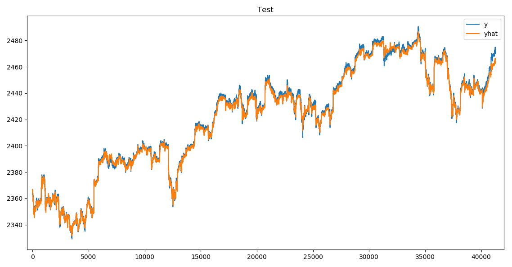

<p align="left">
    <a href="https://www.python.org/">
        </a> &nbsp;
    <br />
    <a href="https://opensource.org/licenses/MIT">
        </a> &nbsp;
</p>

# Index project
This project initially aimed to reproduce result of this article by Sebastian Heinz:
[A simple deep learning model for stock price prediction using TensorFlow](https://medium.com/mlreview/a-simple-deep-learning-model-for-stock-price-prediction-using-tensorflow-30505541d877)

His TensorFlow project is available online at: https://github.com/sebastianheinz/stockprediction

Briefly: his network consists of 5 sequential dense layers.
It takes 500 stock prices as input and outputs index price prediction for the next 1 minute.
Input and output prices are normalized with **MinMaxScaler** from **sklearn.preprocessing** package.

> **I managed to reproduce his results.
> After that I performed some analysis and came to conclusion
> that this scheme can not predict price movements with enough accuracy.**

I came a little further and tried different input values and trained model for different outputs.
Without significant success, though.

It is not surprise that stock market data is noisy especially at short time intervals.
And it is so volatile that it leaves merely no hope for neural networks to converge.

Below you may find detailed description of data processing, model training and testing.

## Data
I downloaded data from original article from [here](http://files.statworx.com/sp500.zip) 
It contains prices for the period from April to July 2017
including 500 stocks and S&P500 index with 1 minute interval.

You may find CSV data file at: `SP500/sp500_prices.csv.gz`

Note: I shifted S&P500 index price 1 minute to the future, because in the original work
they were shifted 1 minute back to the past.
But my script preprocesses data on-the-fly depending on the argument `target_offset`
which specifies the number of periods to shift target price column.
This allows you to try and test different target prediction offsets.
But it requires target prices to be initially in their true time, 'unshifted'.

Generally speaking you can choose to feed into neural network one of the following:
- Prices. Of course, you should normalize prices. I suggest the best way is **MinMaxScaler**,
  as we don't have any outliers in stock prices.
- Differences of prices: *(Latest_Price - Price_One_Interval_Ago)*.
  These values can contain some outliers with high magnitude. 
  To normalize these values you can use: **StandardScaler(with_mean=False, with_std=True)**.
  See note below.
- Logreturns: *Ln(Latest_Price/Price_One_Interval_Ago)*.
  These values are less likely to contain outliers than differences.
  Again **StandardScaler(with_mean=False, with_std=True)** or even **MaxAbsScaler**
  are appropriate to normalize them.

Note: I suggest using **StandardScaler** with argument
`with_mean=False` in order to keep signs of price changes. I.e. if over last
interval price grew up this normalized value should have positive sign,
and negative - if price fell down. I believe this is important for NN to learn smoothly.  

> When speaking about normalization I encourage you to read this article:
> [Preprocessing data](https://scikit-learn.org/stable/modules/preprocessing.html#preprocessing-scaler)

> And also comparision of different scaling methods:
> [Compare the effect of different scalers on data with outliers](https://scikit-learn.org/stable/auto_examples/preprocessing/plot_all_scaling.html#sphx-glr-auto-examples-preprocessing-plot-all-scaling-py)

Functions to work with dataset are located in `data.py`

### Loading dataset

Loading dataset from CSV file is fairly easy when using **pandas** package:
```python
import pandas as pd

def loadDataset(file_name):
    dataset = pd.read_csv(file_name)
    dataset['DATETIME'] = pd.to_datetime(dataset['DATETIME'])
    dataset.set_index('DATETIME', inplace=True)
    return dataset
```
Note: after reading CSV file we convert _DATETIME_ column into `dtype=datetime64` type.
And set this column as index for _dataset_.

### Splitting dataset into train and test set
Since we are working with time-series we should be careful when splitting dataset.
It would be wrong to randomly assing each interval sample either to train or to test datasets.
Example of such **wrong split** looks like this: 


In this case model will easily learn the curve and won't generalize any latent knowledge behind.

The best way would be to split the whole time-series into two unequal parts,
like author of the original work did.

But I prefer another approach: choose some outer interval like week, month or quarter,
and split each outer interval of source sequence into two unequal parts: train and test.
Result of such **correct split** would look like this:
 


Here each month is split into train series (blue) and test series (red).

With such approach you won't fool yourself and will clearly see when your model overfits to train data.

### Preprocessing data

Preprocessing is implemented in function `preprocessDataset` in `data.py`.

We are given the following arguments:
- `dataset` as **pandas.DataFrame**, where target price is the last column.
- `target_offset` - the number of periods to make prediction into the future.
   I.e. with `target_offset=1` we train model to predict target price in 1 minute.

If you choose to feed into model simply _prices_ then you need just to shift target price for `target_offset` intervals:
```python
    input_columns = dataset.columns[:-1]
    target_columns = dataset.columns[-1:]

    dataset[target_columns] = dataset[target_columns].shift(periods=-target_offset)
```

Computing _differences_ of prices is very easy with pandas:
```python
    # Converting absolute input price values into differences
    dataset[input_columns] = dataset[input_columns].diff(periods=1)
    # Converting absolute target price into differences with target_offset
    dataset[target_columns] = dataset[target_columns].diff(periods=target_offset)
    dataset[target_columns] = dataset[target_columns].shift(periods=-target_offset)
```

Computing _logreturns_ is just a little bit trickier:
```python
    # Converting input prices into log-returns
    dataset[input_columns] = np.log(1 + dataset[input_columns].pct_change(periods=1))
    # Converting target prices into log-returns
    dataset[target_columns] = np.log(1 + dataset[target_columns].pct_change(periods=target_offset))
    dataset[target_columns] = dataset[target_columns].shift(periods=-target_offset)
```

Note: after preprocessing there may appear NaN values in dataset,
at the first row when computing _differences_ or _logreturns_.
They must be removed from dataset as follows:
```python
    dataset.dropna(how='any', inplace=True)
```

### Normalizing data

Dataset normalization is essential to speed-up model training.

You can use **sklearn.preprocessing** package to normalize **pandas.DataFrame** dataset.

I initialize `scaler` in `train.py` basing on `preprocess` argument as follows:
```python
    from sklearn.preprocessing import StandardScaler, MinMaxScaler

    # Setup appropriate scaler depending on preprocess argument
    scaler = StandardScaler(with_mean=False, with_std=True) if (preprocess == 'diff') or (preprocess == 'logret')\
        else MinMaxScaler()
```

This scaler is then used in `normalizeDataset` function in `data.py`:
```python
    dataset.iloc[:, :] = scaler.fit_transform(dataset.to_numpy())
```

That is it! Simple and quick solution, thanks to **sklearn.*** packages!

## Model

### `fc5` - Original model
Model from original article had the following structure:

 N | Layer | Input Size | Output Size
--- | ----- | ----- | ----
 1 | Linear | 500 | 1024
 2 | Linear | 1024 | 512
 3 | Linear | 512 | 256
 4 | Linear | 256 | 128
 5 | Linear | 128 | 1

In this project you may find it in `modules/fc5.py`

This model works with individual samples, not sequences.

Some other kinds of model are briefly described below.

### `winfc5` - Windowed Dense Model

This model has five dense layers that work in 'windowed' mode.

It means that model works with sequences, not with individual samples.
It expects input of size:
`(nSequenceSize x nBatchSize x nPrices)`

Internally model iterates over sequence and processes 10 sequential frames at a time.
I.e. for S&P500 it processes 10x500 = 5000 numbers as input at each step.

 N | Layer | Input Size | Output Size
--- | ----- | ----- | ----
 1 | Linear | 5000 | 1024
 2 | Linear | 1024 | 512
 3 | Linear | 512 | 256
 4 | Linear | 256 | 128
 5 | Linear | 128 | 1

This model tends to overfit.

### `lstm1` - Recurrent Model

This model has one recurrent LSTM layer and some other dense layer at output.

This model works with sequences, it expects input of size:
`(nSequenceSize x nBatchSize x nPrices)`

Internally model iterates over sequence and processes each step separately,
keeping hidden state and cell state.

 N | Layer | Input Size | Output Size
--- | ----- | ----- | ----
 1 | LSTM | 500 | 250
 2 | Linear | 250 | 1

It is highly prone to overfitting.

### Addressing overfitting

Datasets for this project are typically small so some models tend to overtfit as hell.

Trying to achieve best results I have found that following solutions work:
1. Select random batches for each iteration without replacement.
Even more strictly: never repeat the same sample (or sequence) during one epoch
and randpermute training samples (or sequences) before next epoch.
Use `np.random.permutation` or `torch.randperm`.
See `iterateDataset` function in `data.py`.
1. Use `dropout`. As you may see in `models` I use input dropout from 0.05 up to 0.7.
For recurrent layers you may also try `recurrent_dropout` with rates typically lower than input dropout.
1. Add noise to input data. For normalized input values of range [0...1] noise can be around 0.01.
For recurrent layers you may also try `recurrent_noise` with some lesser rates.
1. Use L2 regularization. See `weightDecay` function in `train.py`.

## Training

### Parameters and configuration
In order to train a model you need first to specify [hyper]parameters for `train.py` either in `Params` dictionary
or in a command line:
```python
Params = dict(
    model='fc5',
    preprocess=None,
    target_offset=1,
    sequence_size=128,
    batch_size=256,
    learning_rate=0.000003,
    weight_decay=300,
    early_stop=0.3
)
```

A few words about [hyper]parameters:
- `model`: a model file name (without .py extension) which should be located in `models` directory.
- `preprocess`: should be 'diff' for price differences, 'logret' for logreturns and 'none' or None for simple prices.
- `target_offset`: for how many intervals to predict target price.
- `sequence_size`: size of sequences at training time.
  Applicable only for models that accept sequences (i.e. `model.sequential == True`).
  The bigger the sequence_size - the smoother the learning curves, the more memory is required.
- `batch_size`: number of samples (or sample sequences) for one batch.
  The bigger the batch_size - the smoother the learning curves, the more memory is required.
- `learning_rate`: choose from 1e-3 down to 1e-6.
  The lower the learning rate - the smoother the learning curves, the better the result,
  the longer it takes time to fit model.
- `weight_decay`: choose from 1 to 300. This value is multiplied by `learning_rate`.
  Keep in mind that I don't use Adam's optimizer internal weight decay, as it is implemented incorrectly IMHO.
  See [Decoupled Weight Decay Regularization](https://arxiv.org/abs/1711.05101) for more details.
  Instead there is a simple and robust function `weightDecay` which merely does:
  `weights -= weights*weight_decay*learning_rate` before adding optimizer gradients.
- `early_stop`: choose from 0.05 up to 0.5.
  While iterating through batches script periodically validates model on a test dataset.
  And the lowest test error is remembered along with the best parameters that lead to such low error.
  If eventually test error grows more than early_stop from lowest point - the learning cycle is stopped:
  `(test_loss >= early_stop*min_test_loss)`

Since I made this project not only for S&P500, but for any other stock index as well,
you need to specify one required argument in a command-line - a configuration directory.

This directory should contain `__init__.py` file with some index parameters specified
and a dataset file in CSV format (may be gzipped).

For now you may just run:
```bash
python train.py SP500
```

### Initializing

At start you will see that script initializes model and tries to load model parameters from file.
Filename looks like: `fc5_tar1_None_hid1024_lr3e-06_wd300_bs256_dr0.5_nz0.1.pt` -
it starts with a model name and contains values of all the hyperparameters.
While `.pt` is a PyTorch default extension.

If file exist - model parameters are loaded,
otherwise - they are initialized randomly by default pyTorch initialization scheme. 

Then dataset is loaded, preprocessed and normalized.

### Main cycle

Main cycle runs until early stopping criterion is met or for 2000 epochs at maximum.

Unlike common scenario, I perform validation on test dataset not after training epoch end, but more often.
As the datasets for this project are typically small and validation on a whole test dataset takes a little time.
This has advantage as we can now precisely detect moment when model starts to overfit.

Statistics is gathered with log-interval (=5sec by default).

Periodically with autosave-interval (=60sec by default) best model parameters,
learning curves and statistics are saved to files. 

Typical learning curve looks like this:


Note: y-axis (error) has log-scale, x-axis is number of 5-second log intervals.

Upon completion script outputs final results:
```bash
Early stopping
Saving best model to fc5_tar1_None_hid1024_lr3e-06_wd300_bs256_dr0.5_nz0.1.*
Saving stat to fc5_tar1_None_hid1024_lr3e-06_wd300_bs256_dr0.5_nz0.1.csv
Final results:
 train_loss=0.0032860608771443367 test_loss=0.0030848775058984756 min_test_loss=0.0030848775058984756
``` 

## Testing

### Running test
To test trained model you should:
1. Copy `Params` dictionary from `train.py` to `test.py`.
1. Rename model state file from full name:`fc5_tar1_None_hid1024_lr3e-06_wd300_bs256_dr0.5_nz0.1.pt`
  to short name: `fc5.pt`.

After that you may run `test.py` script as follows:
```bash
python test.py SP500
```

This script loads model, loads dataset, passes dataset through model and analyses result.
Upon completion you should see a chart with target price (y) and prediction (yhat).



Curves look very similar yet predicted curve is slightly shifted from original one.

### Analysing performance of model

After training model shows as little error as `0.00006922` on test dataset.
Please keep in mind that this value is for normalized output.

Since we used _prices_ (not _differences_ or _logreturns_), **MinMaxScaler** was used for normalization.

Hence we can convert error back to USD as follows:
`error_usd = error*(target_max-target_min)`

Price of S&P500 in our dataset has following characteristics:
- `min(price): $2329.14`
- `max(price): $2490.65`
- `mean(price): $2421.54`
- `std(price): $39.56`
- `mean(abs(price[t] - price[t-1])): $30.70` - typical price change over interval.

So `error_usd = 0.00006922 * 161.51 = $0.11`. 11 cents!
This error can be the result of bias shift of predicted chart.
But this error is not really important as I explain further.

We don't actually need _'predicted S&P500 price'_, if we want to exploit this algorithm for profit.
Because, generally speaking, we can only select from two actions:
- Buy
- Sell

**So we only need to know weather price will go up or down the next interval.**

It means we should use another metric to measure model performance.
We need to know how many times model correctly predicts price movement up or down.

This can be easily done for _prices_ if we calculate differences
and then multiply those differences for source and predicted prices:
```python
    dy = y[1:] - y[:-1]
    dyhat = yhat[1:] - yhat[:-1]
    d = dy * dyhat

    # Number of times NN correctly predicted future price movement up or down
    n_pos = (d >= 0).sum()
    # Number of times NN failed to predict future price movement up or down
    n_neg = (d < 0).sum()
```

For _differences_ or _logreturns_ it is even more simple:
```python
    d = y * yhat

    # Number of times NN correctly predicted future price movement up or down
    n_pos = (d >= 0).sum()
    # Number of times NN failed to predict future price movement up or down
    n_neg = (d < 0).sum()
```

Let's see what we have got:
```bash
Loss: 0.00012117950973333791
Number of source timesteps: 41265
Total number of predictions: 41265
Count of correct predictions: 21013
Count of incorrect predictions: 20251
Mean error for correct prediction: 0.40147867798805237
Mean error for incorrect prediction: 0.6707038879394531
```

It means that our model can correctly predict price movements for only
`21013/41265 = 50.92%`. **This can not be used for any profit!**

I tried different hyperparameters, different models and other indexes
and managed to achieve at maximum: **53% accuracy**.
That is still not enough to make profit!

I also tried to change MSE criterion to accuracy function:
```python
def calculateLoss(yhat, y, preprocess):
    if (preprocess == 'diff') or (preprocess == 'logret'):
        err = (y - yhat)
    else:
        dy = y[1:] - y[:-1]
        dyhat = yhat[1:] - yhat[:-1]
        err = (dy - dyhat)
    loss = th.pow(err, 2).mean()
    return loss.sum()
```

But the results did not change a lot.

## Results

1. I have repeated the result of original article with even lower test error: `0.00069 vs 0.00078`.
  This is about 11 cents for S&P500 Index Price.
  Note that on average price changes for about 30 cents for one minute interval.
  At first sight it gives us hope for profit.
1. Though a simple analysis shows that this is not enough to make profit,
  as we don't need to know just future price with some uncertainty.
  But we need to know if in the nearest future price will raise or fall.
  As we usually can only buy or sell stocks at market.
1. When we test our trained model for this criteria it shows really bad results.
  It can predict future price movement with accuracy only about 51%.
1. I conclude that model only learns index weights of different stocks and has no predictive power.
1. Trying different indexes, different hyperparameters and model architectures I achieved at maximum only 53% accuracy.
  This is still not enough for reliable profit.
1. Anyway, I believe that neural networks are good, but the market data itself is too noisy and volatile
  to make any predictions, especially at minutes intervals.
  I'm open for your examples that prove that I'm wrong )
1. Though this project did not reveal any profitable ideas it was fun and useful.
  When work with _hard-to-analyse_ market data it is then much easier to work with any other kind of data.

Thank you for getting by!
